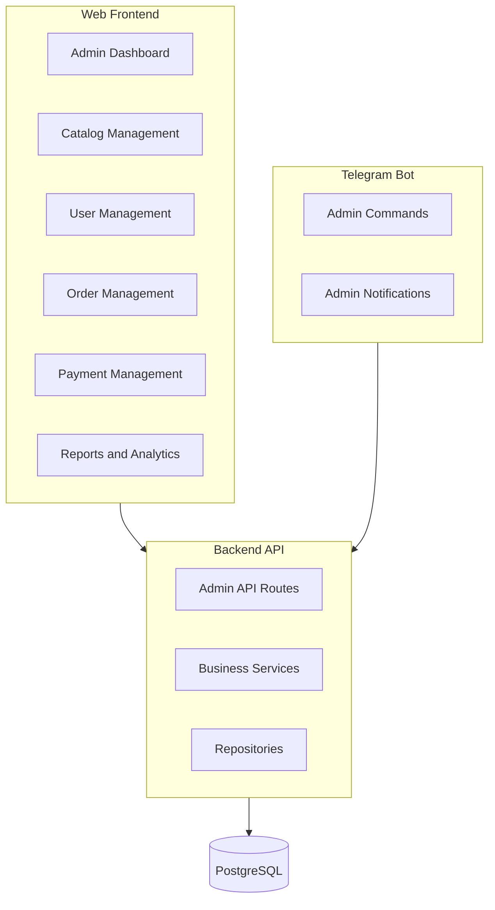

# Sheetaro Admin Panel - Complete Development Plan

Based on [SCOPE.md](SCOPE.md), this plan covers all admin functionality for managing the print ordering platform.---

## Current State

**Backend APIs (Partially Implemented):**

- Categories CRUD: [backend/app/api/routers/categories.py](backend/app/api/routers/categories.py)
- Products CRUD: [backend/app/api/routers/products.py](backend/app/api/routers/products.py)
- Users management: [backend/app/api/routers/users.py](backend/app/api/routers/users.py)
- Orders: [backend/app/api/routers/orders.py](backend/app/api/routers/orders.py)
- Payments: [backend/app/api/routers/payments.py](backend/app/api/routers/payments.py)

**Frontend Admin Pages (Placeholders):**

- `/admin` - Dashboard
- `/admin/catalog` - Empty
- `/admin/users` - Empty
- `/admin/payments` - Basic

---

## Architecture



---

## Phase 1: Catalog Management (Week 1-2)

### Backend

| Task | File | Description ||------|------|-------------|| Categories API | `categories.py` | Already exists - verify CRUD || Products API | `products.py` | Add admin-only create/update/delete || Design Plans API | `categories.py` | Add plan pricing management || Attributes API | `categories.py` | Material, size options |

### Frontend `/admin/catalog`

- Category list with add/edit/delete
- Product list with filtering by type (LABEL/INVOICE)
- Design plans pricing editor
- Attributes/options management (size, material)

### Bot

- `/admin_catalog` - View categories summary
- Inline keyboard for quick enable/disable

---

## Phase 2: User Management (Week 2-3)

### Backend API

| Endpoint | Method | Description ||----------|--------|-------------|| `/admin/users` | GET | List users with filters || `/admin/users/{id}` | PATCH | Update user role/status || `/admin/users/{id}/ban` | POST | Ban user || `/admin/stats/users` | GET | User statistics |

### Frontend `/admin/users`

- User list with search/filter (role, status, date)
- Role assignment (Designer, Validator, Print Shop)
- User details modal
- Ban/unban actions

### Bot

- `/admin_users` - Quick user search
- Role assignment via inline buttons

---

## Phase 3: Order Management (Week 3-4)

### Backend API

| Endpoint | Method | Description ||----------|--------|-------------|| `/admin/orders` | GET | All orders with filters || `/admin/orders/{id}/assign` | POST | Assign to staff || `/admin/orders/{id}/status` | PATCH | Force status change || `/admin/orders/stats` | GET | Order statistics |

### Frontend `/admin/orders`

- Order list with status filters
- Kanban view by status
- Assign to designer/validator/printshop
- Order timeline view
- Bulk actions

### Bot

- `/admin_orders` - Pending orders summary
- Quick assign via inline keyboard
- Status update notifications

---

## Phase 4: Payments and Settlements (Week 4-5)

### Backend API

| Endpoint | Method | Description ||----------|--------|-------------|| `/admin/payments` | GET | All payments || `/admin/payments/{id}/verify` | POST | Verify card-to-card || `/admin/settlements` | GET | Settlement queue || `/admin/settlements/process` | POST | Process weekly settlement || `/admin/stats/revenue` | GET | Revenue analytics |

### Frontend `/admin/payments`

- Payment receipts review
- Verify/reject with reason
- Settlement list by staff
- Weekly settlement processor
- Revenue charts

### Bot

- `/admin_payments` - Pending verifications
- Quick verify/reject buttons
- Settlement reminders

---

## Phase 5: Reports and Dashboard (Week 5-6)

### Backend API

| Endpoint | Method | Description ||----------|--------|-------------|| `/admin/stats` | GET | Dashboard KPIs || `/admin/reports/orders` | GET | Order reports || `/admin/reports/revenue` | GET | Revenue reports || `/admin/reports/sla` | GET | SLA compliance |

### Frontend `/admin`

- KPI cards (orders, revenue, users)
- Charts (daily orders, revenue trend)
- SLA compliance meters
- Recent activity feed
- Alerts (pending actions)

---

## Phase 6: Settings and System (Week 6)

### Backend API

| Endpoint | Method | Description ||----------|--------|-------------|| `/admin/settings/pricing` | GET/PATCH | Platform pricing || `/admin/settings/payment-card` | GET/PATCH | Payment card info || `/admin/settings/commissions` | GET/PATCH | Commission rates |

### Frontend `/admin/settings`

- Platform pricing editor
- Payment card configuration
- Commission rate settings
- System notifications settings

---

## File Structure

```javascript
frontend/src/app/(dashboard)/admin/
├── page.tsx              # Dashboard
├── catalog/
│   ├── page.tsx          # Catalog overview
│   ├── categories/
│   │   └── page.tsx      # Categories CRUD
│   ├── products/
│   │   └── page.tsx      # Products CRUD
│   └── plans/
│       └── page.tsx      # Design plans
├── users/
│   └── page.tsx          # Users management
├── orders/
│   └── page.tsx          # Orders management
├── payments/
│   └── page.tsx          # Payments verification
├── settlements/
│   └── page.tsx          # Staff settlements
├── reports/
│   └── page.tsx          # Analytics
└── settings/
    └── page.tsx          # System settings

bot/handlers/
├── admin_catalog.py
├── admin_users.py
├── admin_orders.py
└── admin_payments.py
```

---

## Implementation Priority

| Priority | Feature | Est. Time ||----------|---------|-----------|| P0 | Catalog CRUD (categories, products) | 3 days || P0 | User role management | 2 days || P1 | Order monitoring and assignment | 3 days || P1 | Payment verification | 2 days || P2 | Dashboard KPIs | 2 days || P2 | Settlements | 2 days || P3 | Reports and charts | 3 days || P3 | Bot admin commands | 2 days |**Total Estimate: 4-6 weeks**---

## Notes

- All admin endpoints require `is_admin` check
- Use existing [deps.py](backend/app/api/deps.py) `require_admin` dependency