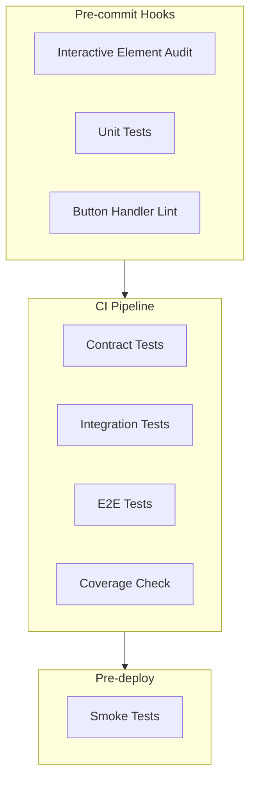

# Comprehensive Testing Strategy Implementation

## Problem Statement

Current tests do not catch missing onClick handlers, form validation issues, or API schema mismatches. This leads to broken buttons and forms reaching production.

## Solution Architecture



---

## Phase 1: Interactive Element Audit Tests

Create automated tests that scan all pages for buttons without handlers.**File:** [`frontend/src/__tests__/audits/interactive-elements.test.tsx`](frontend/src/__tests__/audits/interactive-elements.test.tsx) (already created)**Additional audits to add:**

- Form validation audit
- Link href audit
- Modal open/close audit

---

## Phase 2: CRUD Test Templates

Create standardized test templates for all CRUD operations.**File:** `frontend/src/__tests__/templates/crud.template.ts`

```typescript
// Template for testing any CRUD feature:
// - CREATE: button -> modal -> validation -> API call
// - READ: list -> empty state -> loading state
// - UPDATE: edit button -> modal with data -> API call
// - DELETE: confirm -> API call -> removal
```

---

## Phase 3: Contract Tests (Frontend/Backend Schema Sync)

Ensure frontend forms match backend Pydantic schemas.**File:** `frontend/src/__tests__/contracts/` (already exists, expand coverage)**Schemas to test:**

- CategoryCreate/Update
- ProductCreate/Update
- PlanCreate/Update
- OrderCreate/Update
- PaymentVerification

---

## Phase 4: E2E Critical Path Tests

Expand Playwright tests for all admin CRUD operations.**File:** [`frontend/e2e/admin-catalog.spec.ts`](frontend/e2e/admin-catalog.spec.ts)**Tests to add:**

1. Admin can create/edit/delete category
2. Admin can create/edit/delete product
3. Admin can create/edit/delete plan
4. Form validation prevents invalid submissions
5. Error toasts display correctly

---

## Phase 5: Pre-commit Hook

Prevent commits with broken buttons.**File:** `.husky/pre-commit`

```bash
# 1. Audit tests
# 2. Unit tests for changed files
# 3. Grep for buttons without handlers
```

---

## Phase 6: CI/CD Pipeline

**File:** `.github/workflows/test.yml`

```yaml
jobs:
  audit:     # Interactive element audit
  unit:      # Unit tests with 80% coverage threshold
  contract:  # Schema validation
  e2e:       # Playwright tests
```

---

## Phase 7: Test Scripts in package.json

**File:** [`frontend/package.json`](frontend/package.json)Add scripts:

- `test:audit` - Run audit tests only
- `test:crud` - Run CRUD template tests
- `test:precommit` - All pre-commit checks
- `lint:buttons` - Check for buttons without handlers

---

## Phase 8: Documentation

**File:** `frontend/TESTING.md`Document:

- Testing conventions
- How to write tests for new features
- Required tests checklist
- CI/CD pipeline explanation

---

## Files to Create/Modify

| File | Action | Description ||------|--------|-------------|| `src/__tests__/audits/form-validation.test.tsx` | Create | Audit all forms for validation || `src/__tests__/audits/link-href.test.tsx` | Create | Audit all links for valid hrefs || `src/__tests__/templates/crud.template.ts` | Create | CRUD test template || `e2e/admin-catalog.spec.ts` | Expand | Full CRUD E2E tests || `.husky/pre-commit` | Create | Pre-commit hook || `.github/workflows/test.yml` | Create/Update | CI pipeline || `package.json` | Update | Add test scripts || `TESTING.md` | Create | Documentation |---

## Expected Outcome

After implementation:

- No button can be merged without onClick handler
- No form can be merged without validation tests
- No API schema mismatch will reach production