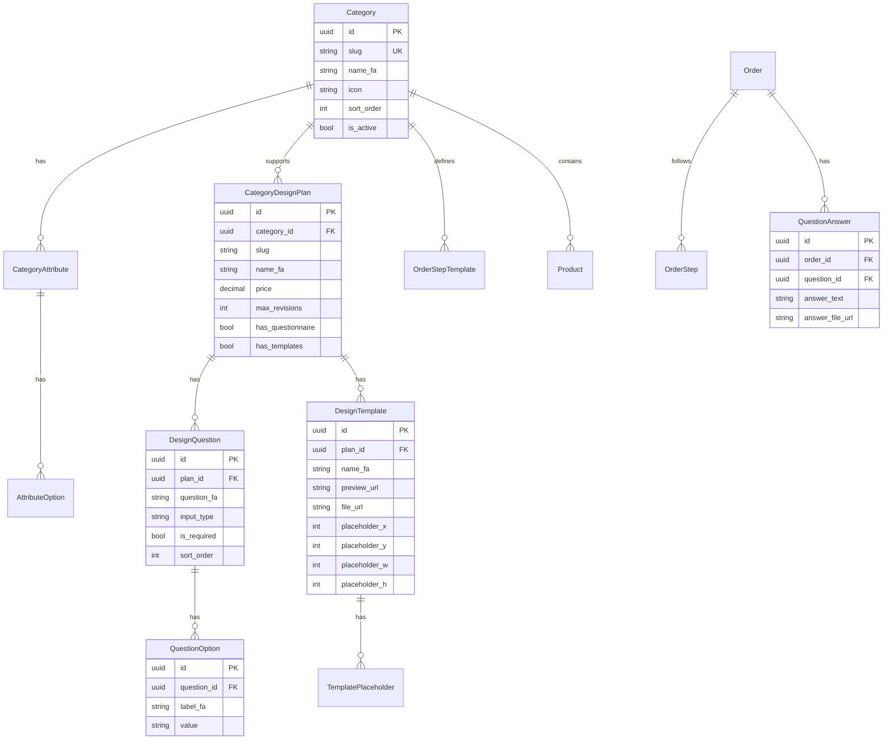

# سیستم داینامیک محصولات و مراحل سفارش (نسخه کامل)

## بخش 1: کد مخفی ادمین شدن

پیام `make_me_admin_secret` در ربات --> ادمین شدن کاربر

---

## بخش 2: مدل داده‌ها (کامل)



---

## بخش 3: سیستم پرسشنامه داینامیک (پلن نیمه‌خصوصی)

### انواع سوالات:
| نوع | مثال |
|-----|------|
| `TEXT` | توضیح درباره کسب‌وکار |
| `SINGLE_CHOICE` | سبک مورد علاقه (مدرن/کلاسیک/مینیمال) |
| `MULTI_CHOICE` | رنگ‌های مورد علاقه |
| `IMAGE_UPLOAD` | نمونه طرح‌های مورد علاقه |
| `COLOR_PICKER` | رنگ اصلی برند |

### فلوی ادمین:
```
پنل مدیریت --> پلن نیمه‌خصوصی --> مدیریت پرسشنامه
    ├── ➕ سوال جدید
    │   ├── متن سوال
    │   ├── نوع (TEXT/SINGLE/MULTI/IMAGE/COLOR)
    │   ├── گزینه‌ها (برای چندگزینه‌ای)
    │   └── اجباری؟
    ├── 📝 ویرایش سوال
    ├── ⬆️⬇️ تغییر ترتیب
    └── 🗑️ حذف سوال
```

### فلوی کاربر:
```
انتخاب پلن نیمه‌خصوصی --> پرداخت --> پرسشنامه
    سوال 1: "کسب‌وکار شما چیست؟" [TEXT]
    سوال 2: "سبک مورد علاقه؟" [مدرن] [کلاسیک] [مینیمال]
    سوال 3: "رنگ‌های مورد علاقه؟" [قرمز] [آبی] [سبز]
    سوال 4: "لوگو یا نمونه طرح آپلود کنید" [UPLOAD]
    --> ارسال به طراح
```

---

## بخش 4: سیستم قالب‌های عمومی (با جایگزینی خودکار لوگو)

### ساختار قالب:
- **preview_url**: تصویر پیش‌نمایش (با مربع قرمز)
- **file_url**: فایل اصلی برای پردازش
- **placeholder**: مختصات مربع قرمز (x, y, width, height)

### فلوی ادمین:
```
پنل مدیریت --> پلن عمومی --> مدیریت قالب‌ها
    ├── ➕ قالب جدید
    │   ├── نام قالب
    │   ├── آپلود تصویر پیش‌نمایش (PNG با مربع قرمز)
    │   ├── تعیین مختصات Placeholder
    │   │   (x, y از گوشه بالا-چپ)
    │   │   (width, height)
    │   └── ذخیره
    ├── 📝 ویرایش قالب
    └── 🗑️ حذف قالب
```

### فلوی کاربر:
```
انتخاب پلن عمومی --> مشاهده قالب‌ها (گالری)
    [قالب 1] [قالب 2] [قالب 3]
    
--> انتخاب قالب --> آپلود لوگو/فایل
--> پردازش خودکار:
    1. خواندن مختصات placeholder
    2. resize لوگو به اندازه placeholder
    3. جایگزینی مربع قرمز با لوگو
    4. تولید تصویر نهایی
--> نمایش پیش‌نمایش به کاربر
--> تایید --> ادامه سفارش
```

### پردازش تصویر (Python/Pillow):
```python
from PIL import Image

def apply_logo_to_template(template_path, logo_path, placeholder):
    template = Image.open(template_path).convert("RGBA")
    logo = Image.open(logo_path).convert("RGBA")
    
    # Resize logo to fit placeholder
    logo = logo.resize((placeholder['w'], placeholder['h']))
    
    # Paste logo at placeholder position
    template.paste(logo, (placeholder['x'], placeholder['y']), logo)
    
    return template
```

---

## بخش 5: جداول دیتابیس (کامل)

### جداول اصلی:
| جدول | توضیح |
|------|-------|
| `categories` | دسته‌بندی (لیبل، فاکتور، کارت ویزیت) |
| `category_attributes` | ویژگی‌ها (سایز، جنس، تعداد) |
| `attribute_options` | گزینه‌های ویژگی |
| `category_design_plans` | پلن‌های طراحی |
| `design_questions` | سوالات پرسشنامه (نیمه‌خصوصی) |
| `question_options` | گزینه‌های سوالات چندگزینه‌ای |
| `design_templates` | قالب‌های آماده (عمومی) |
| `order_step_templates` | مراحل سفارش |
| `orders` | سفارشات |
| `order_steps` | مراحل هر سفارش |
| `question_answers` | پاسخ‌های پرسشنامه |

---

## بخش 6: API Endpoints (کامل)

```
# دسته‌بندی‌ها
GET/POST   /api/v1/categories
PATCH/DEL  /api/v1/categories/{id}

# ویژگی‌ها
GET/POST   /api/v1/categories/{id}/attributes
PATCH/DEL  /api/v1/attributes/{id}
POST       /api/v1/attributes/{id}/options
PATCH/DEL  /api/v1/options/{id}

# پلن‌های طراحی
GET/POST   /api/v1/categories/{id}/plans
PATCH      /api/v1/plans/{id}

# پرسشنامه (نیمه‌خصوصی)
GET/POST   /api/v1/plans/{id}/questions
PATCH/DEL  /api/v1/questions/{id}
POST       /api/v1/questions/{id}/options

# قالب‌ها (عمومی)
GET/POST   /api/v1/plans/{id}/templates
PATCH/DEL  /api/v1/templates/{id}

# پردازش تصویر
POST       /api/v1/templates/{id}/apply-logo
           body: { logo_file_url }
           response: { preview_url, final_url }

# مراحل سفارش
GET/POST   /api/v1/categories/{id}/steps
PATCH      /api/v1/step-templates/{id}

# سفارش
POST       /api/v1/orders/{id}/answers  (پاسخ پرسشنامه)
```

---

## بخش 7: منوی ادمین (کامل)

```
🔧 پنل مدیریت
├── 📂 مدیریت دسته‌بندی‌ها
│   ├── ➕ دسته جدید
│   ├── 📝 ویرایش دسته
│   └── 🗑️ حذف دسته
│
├── 📋 مدیریت ویژگی‌ها
│   ├── انتخاب دسته --> لیست ویژگی‌ها
│   ├── ➕ ویژگی جدید
│   └── 🎨 گزینه‌های ویژگی
│
├── 🎯 مدیریت پلن‌های طراحی
│   ├── انتخاب دسته --> لیست پلن‌ها
│   ├── ➕ پلن جدید
│   ├── 📝 ویرایش پلن
│   │
│   ├── 📝 مدیریت پرسشنامه (نیمه‌خصوصی)
│   │   ├── ➕ سوال جدید
│   │   ├── نوع: متنی/چندگزینه/آپلود/رنگ
│   │   └── گزینه‌ها
│   │
│   └── 🖼️ مدیریت قالب‌ها (عمومی)
│       ├── ➕ قالب جدید
│       ├── آپلود تصویر
│       └── تعیین مختصات placeholder
│
├── 🔄 مدیریت مراحل سفارش
│
├── 💰 پرداخت‌های در انتظار
├── 👥 مدیریت ادمین‌ها
└── ⚙️ تنظیمات
```

---

## بخش 8: فایل‌های جدید

### Backend:
```
backend/app/models/
├── category.py (جدید)
├── attribute.py (جدید)
├── design_plan.py (جدید)
├── design_question.py (جدید)
├── design_template.py (جدید)
├── order_step.py (جدید)
└── question_answer.py (جدید)

backend/app/services/
├── category_service.py (جدید)
├── template_service.py (جدید) - پردازش تصویر
└── questionnaire_service.py (جدید)

backend/app/api/routers/
├── categories.py (جدید)
├── templates.py (جدید)
└── questionnaires.py (جدید)
```

### Bot:
```
bot/handlers/
├── admin_categories.py (جدید)
├── admin_attributes.py (جدید)
├── admin_plans.py (جدید)
├── admin_questions.py (جدید) - پرسشنامه
├── admin_templates.py (جدید) - قالب‌ها
├── admin_steps.py (جدید)
└── dynamic_order.py (جدید)
```

---

## بخش 9: مثال کامل - تنظیم لیبل

### 1. ساخت دسته:
- نام: لیبل، slug: label، آیکون: 🏷️

### 2. ویژگی‌ها:
- سایز: 5x5 (+0), 10x10 (+5000)
- جنس: کاغذی (+0), PVC (+5000)
- تعداد: حداقل 100

### 3. پلن‌ها:
**عمومی:**
- قیمت: رایگان
- has_templates: true
- قالب‌ها: 5 قالب آماده با مربع قرمز برای لوگو

**نیمه‌خصوصی:**
- قیمت: 600,000
- max_revisions: 3
- has_questionnaire: true
- سوالات:
  1. کسب‌وکار؟ (TEXT)
  2. سبک؟ (SINGLE: مدرن/کلاسیک/مینیمال)
  3. رنگ‌ها؟ (MULTI: قرمز/آبی/سبز/...)
  4. لوگو؟ (IMAGE_UPLOAD)

**خصوصی:**
- قیمت: 5,000,000
- max_revisions: null (نامحدود)

### 4. مراحل:
1. SELECT_OPTION: سایز
2. SELECT_OPTION: جنس
3. ENTER_VALUE: تعداد
4. SELECT_PLAN: پلن طراحی
5. (اگر عمومی) SELECT_TEMPLATE + UPLOAD_LOGO
6. (اگر نیمه‌خصوصی) QUESTIONNAIRE + PAYMENT
7. (اگر خصوصی) PAYMENT
8. VALIDATION (اختیاری)
9. PAYMENT: چاپ
10. PRINT
11. SHIPPING

---

## تخمین زمان

| بخش | زمان |
|-----|------|
| کد مخفی ادمین | 30 دقیقه |
| مدل‌ها و migration | 3-4 ساعت |
| API Endpoints | 4-5 ساعت |
| سرویس پردازش تصویر | 2-3 ساعت |
| پنل ادمین ربات | 6-8 ساعت |
| فلوی سفارش داینامیک | 6-8 ساعت |
| تست و دیباگ | 3-4 ساعت |
| **مجموع** | **25-33 ساعت** |