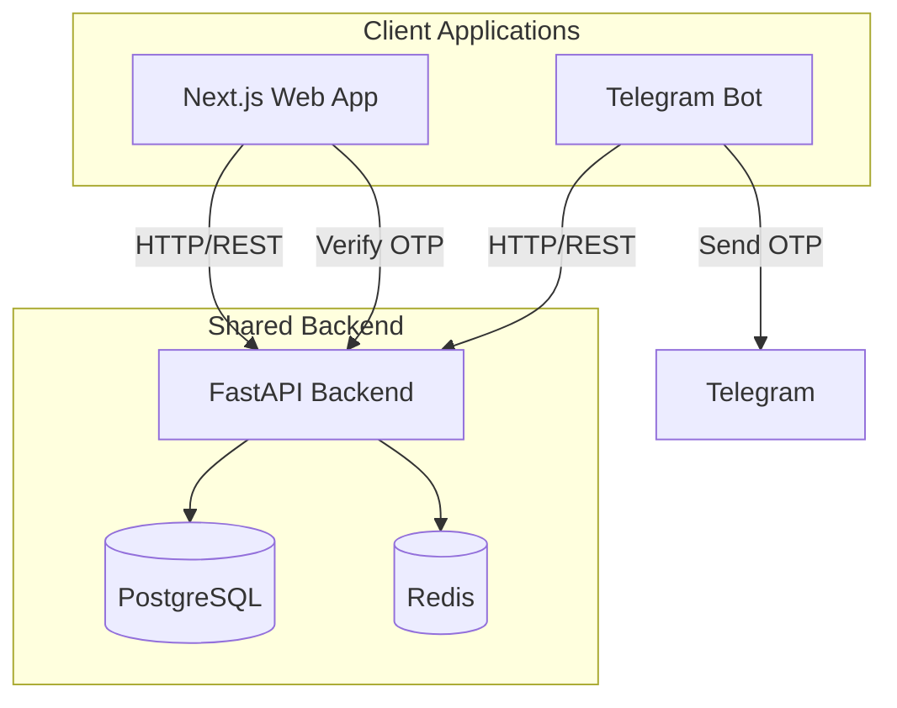

# Sheetaro Web Application Implementation Plan

## Overview

Build a Next.js web application synchronized with the existing Telegram bot, sharing the same FastAPI backend. Users can register independently via web or continue from Telegram by entering a verification code.

## Architecture




## Key Features

### 1. Authentication System

- **Independent Web Registration**: Phone number + Password
- **Telegram Sync**: Bot sends 6-digit verification code, user enters in web app to link accounts
- **JWT Tokens**: For web session management (stored in httpOnly cookies)

### 2. Customer Features (Web)

- Dashboard with order overview
- Dynamic product ordering (categories, attributes, design plans)
- Template gallery with logo upload (for public plans)
- Questionnaire forms (for semi-private plans)
- File upload for own designs
- Order tracking and history
- Profile management
- Payment receipt upload with preview

### 3. Admin Features (Web)

- Admin dashboard with statistics
- Payment approval/rejection with receipt preview
- Catalog management (categories, attributes, plans)
- Questionnaire builder
- Template management with placeholder editor
- User management

## Technical Stack

| Component | Technology ||-----------|------------|| Framework | Next.js 14+ (App Router) || Styling | Tailwind CSS + shadcn/ui || State | React Query (TanStack Query) || Forms | React Hook Form + Zod || Icons | Lucide React || HTTP | Axios || Auth | NextAuth.js or custom JWT |

## Design System

### Color Palette (from logo)

- Primary: `#2D7D46` (Forest Green)
- Primary Light: `#4CAF50`
- Primary Dark: `#1B5E20`
- Background: `#F8FAF8`
- Surface: `#FFFFFF`
- Text Primary: `#1A1A1A`
- Text Secondary: `#6B7280`

### Design Principles

- Minimal, clean interface
- Light theme only (as requested)
- Generous white space
- Soft shadows and rounded corners
- RTL support (Persian language)

## Folder Structure

```javascript
frontend/
├── src/
│   ├── app/                    # Next.js App Router
│   │   ├── (auth)/            # Auth pages (login, register, verify)
│   │   ├── (dashboard)/       # Protected pages
│   │   │   ├── orders/
│   │   │   ├── new-order/
│   │   │   ├── profile/
│   │   │   └── admin/
│   │   ├── layout.tsx
│   │   └── page.tsx
│   ├── components/
│   │   ├── ui/                # shadcn/ui components
│   │   ├── layout/            # Header, Sidebar, Footer
│   │   ├── order/             # Order-related components
│   │   ├── admin/             # Admin panel components
│   │   └── forms/             # Form components
│   ├── lib/
│   │   ├── api.ts             # API client
│   │   ├── auth.ts            # Auth utilities
│   │   └── utils.ts           # Helper functions
│   ├── hooks/                 # Custom React hooks
│   ├── types/                 # TypeScript types
│   └── styles/
│       └── globals.css        # Tailwind + custom styles
├── public/
│   └── images/
├── tailwind.config.ts
├── next.config.js
└── package.json
```


## Backend API Changes

New endpoints needed in [`backend/app/api/routers/`](backend/app/api/routers/):

### Auth Endpoints (new file: `auth.py`)

```javascript
POST /api/v1/auth/register          # Phone + password registration
POST /api/v1/auth/login             # Login with phone + password
POST /api/v1/auth/refresh           # Refresh JWT token
POST /api/v1/auth/telegram-link     # Generate OTP for Telegram sync
POST /api/v1/auth/telegram-verify   # Verify OTP and link accounts
```


### User Model Changes

Add fields to [`backend/app/models/user.py`](backend/app/models/user.py):

- `password_hash` (nullable, for web users)
- `phone_verified` (boolean)
- `web_linked` (boolean, indicates web account exists)

## Implementation Phases

### Phase 1: Foundation (Week 1)

1. Set up Next.js project with Tailwind and shadcn/ui
2. Implement design system (colors, typography, RTL)
3. Create layout components (Header, Sidebar, Footer)
4. Build auth pages (Login, Register)
5. Add auth API endpoints to backend

### Phase 2: Core Features (Week 2)

1. Dashboard page
2. Order listing and details
3. Profile page with edit functionality
4. Telegram sync flow (verification code)

### Phase 3: Order Flow (Week 3)

1. Category selection
2. Attribute selection with dynamic pricing
3. Design plan selection
4. Template gallery for public plans
5. Questionnaire form for semi-private plans
6. File upload for own designs
7. Order summary and confirmation

### Phase 4: Payment and Admin (Week 4)

1. Payment initiation and receipt upload
2. Admin dashboard
3. Payment approval interface
4. Catalog management UI
5. Questionnaire builder
6. Template management

### Phase 5: Polish (Week 5)

1. Responsive design optimization
2. Loading states and error handling
3. Animations and transitions
4. Testing and bug fixes
5. Documentation

## Telegram Bot Integration

Add verification code flow to bot ([`bot/handlers/`](bot/handlers/)):

1. New command `/linkweb` or menu button
2. Generate 6-digit code (store in Redis with 5-min TTL)
3. Send code to user via Telegram message
4. User enters code in web app to link accounts

## Docker Compose Update

Add frontend service to [`docker-compose.yml`](docker-compose.yml):

```yaml
frontend:
  build:
    context: ./frontend
    dockerfile: Dockerfile
  ports:
    - "3000:3000"
  environment:
    - NEXT_PUBLIC_API_URL=http://backend:3001
  depends_on:
    - backend
```


## File Deliverables

1. `/frontend/` - Complete Next.js application
2. `/backend/app/api/routers/auth.py` - New auth endpoints
3. `/backend/app/models/user.py` - Updated with web auth fields
4. `/backend/app/services/auth_service.py` - Auth business logic